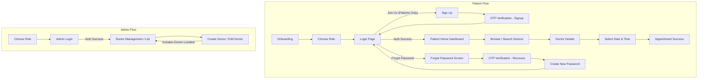

# Doctor Hunt — Comprehensive Project Instructions & Architectural Guide

## 1. Project Overview & Context

- **Project Name:** Doctor Hunt (تطبيق دكتور هَنت)
- **Nature of Project:** Training medical appointment booking application under the **Code Plus** internship program.
- **Level:** Junior Flutter Developer.
- **Developer:** Ali — Software Engineering student at the University of Benghazi.
- **Role & Scope:** Single developer working on the Mobile Application (Patient Flow & Admin Flow) + Supabase Backend (Auth, Database, Storage).
- **Target Platform:** **Android Only**.
- **Design Reference:** Official Figma Design System.

---

## 2. Working Rules & Interaction Protocol (Mandatory)

1. **Adherence to Environment Modes:** Respect Antigravity modes (Discussion Mode vs. Code Mode). Follow the active mode without redundant confirmation.
2. **Modular File Structure:** Do **not** write monolithic UI files. Split complex widgets into dedicated, reusable files under the appropriate `presentation/widget/` directory.
3. **Step-by-Step Execution:** Execute strictly according to Ali's explicit commands. Do **not** jump ahead or implement unrequested features/steps.
4. **Clarification Before Action:** Ensure full comprehension of requirements. If any requirement or design detail is ambiguous, ask **one targeted question at a time**.
5. **Direct & Objective Response Style:**
   - Concise, direct, and free from conversational filler or empty compliments.
   - Lead with the core answer (if "no", state "no" first followed by the technical rationale).
   - Treat developer propositions as hypotheses: critique assumptions, evaluate edge cases, and propose solid architectural alternatives.
   - If an idea is flawed, state it clearly. If partially correct, distinguish between valid aspects and points of failure.
6. **Strict Scope Enforcement:** Stick to the Approved Scope. Anything beyond is a **Bonus** — flag it clearly, but do not implement it autonomously without explicit confirmation.

---

## 3. Technology Stack & Dependencies

| Category | Package / Tool | Version | Purpose |
| :--- | :--- | :--- | :--- |
| **Framework & SDK** | Flutter / Dart SDK | `^3.11.0` | Cross-platform UI Toolkit |
| **Backend as a Service** | `supabase_flutter` | `^2.17.2` | Authentication, PostgreSQL DB, Realtime, Storage |
| **State Management** | `flutter_bloc` / `equatable` | `^9.1.1` / `^2.1.0` | Predictable state container (Cubit pattern) |
| **Dependency Injection** | `get_it` | `^9.2.1` | Service locator for data sources, repositories & clients |
| **Routing & Navigation** | `go_router` / `go_router_builder` | `^17.5.0` / `^4.5.0` | Declarative, type-safe route management |
| **Localization (i18n)** | `slang` / `slang_flutter` | `^4.19.2` / `^4.19.0` | Type-safe multilingual translations (AR / EN) |
| **Environment Config** | `envied` / `envied_generator` | `^1.3.8` | Secure compile-time environment variable injection |
| **Screen Responsiveness**| `flutter_screenutil` | `^5.9.3` | Responsive UI adaptation based on 375x844 canvas |
| **Networking & HTTP** | `dio` / `pretty_dio_logger` | `^5.11.0` / `^1.4.0` | Advanced HTTP client & interceptor logging |
| **Local Persistence** | `hive` / `hive_flutter` / `flutter_secure_storage` | `^2.2.3` / `^11.0.0` | Fast key-value and encrypted local storage |
| **UI Components** | `google_fonts`, `pinput`, `easy_date_timeline`, `flutter_svg`, `flutter_rating_bar`, `flutter_gap` | Latest | Specialized widgets for UI/UX |

---

## 4. Code Generation & `.g.dart` Audit

The project strictly employs code generation for type safety, routing, environment protection, and localization. All generated files must be maintained and regenerated when their source inputs change.

### 4.1. Envied Generator (`api_consts.g.dart`)
- **Source File:** `lib/apps/core/network/api/api_consts.dart`
- **Configuration:** Reads variables from root `.env` (`PROJECT_URL`, `KEY`).
- **Target File:** `lib/apps/core/network/api/api_consts.g.dart` (`_ApiConsts` class).
- **Generation Command:**
  ```bash
  dart run build_runner build --delete-conflicting-outputs
  ```
- **Audit Rule:** Never hardcode Supabase credentials in code. Ensure `.env` is populated and `.env` is declared in `pubspec.yaml` assets if required at runtime, or embedded compile-time via Envied.

### 4.2. GoRouter Builder (`router.g.dart`)
- **Source File:** `lib/apps/core/router/router.dart`
- **Annotations:** `@TypedGoRoute<T>()`, `@TypedStatefulShellRoute<T>()`.
- **Target File:** `lib/apps/core/router/router.g.dart`
- **Key Pattern:** Navigation must use typed extension methods (e.g. `const LoginScreenRoute().go(context)` or `DoctorDetailsRout(doctorId: '123').push(context)`).
- **Generation Command:**
  ```bash
  dart run build_runner build --delete-conflicting-outputs
  ```
- **Audit Rule:** When adding new screens or route parameters, declare the `@TypedGoRoute` class inside `router.dart` and rerun `build_runner`.

### 4.3. Slang Localization (`strings*.g.dart`)
- **Config File:** `slang.yaml` (`base_locale: en`, `input_directory: lib/i18n`, `output_directory: lib/generated`, `translate_var: tr`).
- **Source Files:** `lib/i18n/ar.i18n.json`, `lib/i18n/en.i18n.json`.
- **Target Files:**
  - `lib/generated/strings.g.dart`
  - `lib/generated/strings_ar.g.dart`
  - `lib/generated/strings_en.g.dart`
- **Usage:** Access translations via `t.onboarding...`, `t.auth...`, `t.home...`.
- **Generation Command:**
  ```bash
  dart run slang
  ```
- **Audit Rule:** No hardcoded strings in widgets. All Arabic and English copy must be added to both JSON files before generating code.

### 4.4. Custom Style Atoms (`style_atoms.dart`)
- **Generator Script:** `generate_styles.dart` (located at root).
- **Source Inputs:** `AppColors` (`lib/apps/core/themes/app_colors.dart`) + predefined font weights & sizes.
- **Target File:** `lib/generated/style_atoms.dart`
- **Generation Command:**
  ```bash
  dart run generate_styles.dart
  ```
- **Usage:** Fluent BuildContext typography getters (e.g., `context.bold16Primary`, `context.medium14TextSub`).

### 4.5. JSON Serializable (Models)
- **Dependencies:** `json_annotation` & `json_serializable`.
- **Audit Rule:** Whenever a model requires Supabase JSON serialization/deserialization, add `part '<model_name>.g.dart';` with `@JsonSerializable()` annotation and execute `build_runner`.

---

## 5. Architectural Directory Layout (Feature-First)

```text
lib/
├── main.dart                                # Application Entry Point & Initialization
├── generated/                               # Slang & Style Generators Output
│   ├── strings.g.dart
│   ├── strings_ar.g.dart
│   ├── strings_en.g.dart
│   └── style_atoms.dart
├── i18n/                                    # Translation Source JSONs
│   ├── ar.i18n.json
│   └── en.i18n.json
└── apps/
    ├── core/                                # Shared Cross-Feature Core Module
    │   ├── extensions/                      # BuildContext, GetIt, DateTime, Controller Extensions
    │   │   ├── build_context_ex.dart
    │   │   ├── display_time_date_extensions.dart
    │   │   ├── get_it_extensions.dart
    │   │   └── text_editing_controller_ex.dart
    │   ├── models/                          # Shared Domain Models (DoctorModel, Availability)
    │   ├── network/                         # Supabase / API Configurations & Error Handling
    │   │   ├── api/ (api_consts.dart, api_consts.g.dart)
    │   │   ├── error/ (app_exception.dart)
    │   │   └── test/ (dummy_data.dart)
    │   ├── router/                          # GoRouter Typed Configuration
    │   │   ├── router.dart
    │   │   └── router.g.dart
    │   ├── themes/                          # AppColors, Themes
    │   ├── utils/                           # AppImages, GetIt Setup
    │   └── widgets/                         # Reusable Foundation UI Widgets
    │       ├── app_app_bar.dart
    │       ├── app_back_ground.dart
    │       ├── app_button.dart
    │       ├── app_scaffold.dart
    │       └── custom_form_field.dart
    └── features/                            # Business Features Layer
        ├── common/                          # Shared Features Across Roles
        │   ├── auth/                        # Supabase Authentication Module
        │   │   ├── data/ (datasources, models, repo)
        │   │   └── presentation/ (controller/cubit, screens, widget)
        │   ├── choose_role/                 # Patient vs Admin Role Selection
        │   └── onboarding/                  # Introduction Carousel
        └── patient/                         # Patient-Specific Features
            ├── home/                        # Patient Dashboard & Search
            ├── doctor_details/              # Doctor Biography & Stats
            ├── doctor_select_time/          # Slot Booking & Availability
            └── main/                        # Bottom Navigation Shell (Root)
```

---

## 6. Approved Functional Scope & User Flows



### 6.1. Patient Flow Specifics
1. **Onboarding & Role Selection:** User is introduced to the app and selects the **Patient** role.
2. **Authentication:**
   - **Login Page:** Includes fields for email/password and contains the **"Join Us"** button (visible **only** to patients).
   - **Sign Up:** Collects full name, email, password.
   - **Email Confirmation (OTP):** Verification token sent via email (`OtpFlow.signUp`).
   - **Forgot Password:** Requests email -> sends 6-digit OTP (`OtpFlow.recovery`) -> navigates to **Create New Password** -> returns to Login.
3. **Doctor Discovery & Booking:**
   - **Home Screen:** Live doctors, popular doctors, featured doctors, and search bar.
   - **Doctor Details:** Bio, rating, hourly price, stats (running, ongoing, patient counts), services.
   - **Select Date & Time:** EasyDateTimeline selector, morning/evening slot chips.
   - **Direct Booking:** Flow proceeds **directly** from date/time selection to **Appointment Success** (no intermediate details questionnaire).

### 6.2. Admin Flow Specifics
1. **Login Only:** Admin logs in directly via email & password. There is **no Sign Up** option in the Admin UI.
2. **Backend Provisioning:** Admin accounts are seeded/created directly in Supabase (Auth + roles metadata).
3. **Doctor Management:**
   - List registered doctors.
   - **Create / Edit Doctor:** Admin inputs doctor details, including **Location** (stored in Supabase database and rendered in the patient-facing app).
4. **Bonus Note:** Admin self-registration via UI is an unrequired bonus.

---

## 7. Development Guidelines & Best Practices

1. **State Management Protocol:**
   - Use `AuthCubit` / `Cubit<T>` with explicit, immutable states (`Initial`, `Loading`, `Success`, `Failure`).
   - Catch `AppException` in Cubits and map user-facing error messages cleanly to UI via SnackBars / Dialogs.
2. **Dependency Injection Standard:**
   - Register singletons in `lib/apps/core/utils/get_it_service.dart`.
   - Use `GetItExtensions` (`getIt.supabase`, `getIt.authRepo`) for clean call sites.
3. **Design System & Styling:**
   - Use `AppColors` for all palette references.
   - Utilize `style_atoms.dart` extensions on `BuildContext` for consistent typography.
   - Wrap dynamic dimensions in `.w`, `.h`, `.r`, `.sp` from `flutter_screenutil`.
4. **Data Isolation:**
   - Data Sources (`SupabaseDataSource`) handle raw Supabase SDK calls.
   - Repositories (`AuthRepo`) catch `AuthException` / general errors and wrap them into `AppException`.
   - Presentation layer only interacts with Repositories through Cubits.
